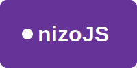

# nizoJS  
_Africa's First JavaScript Framework_



*Empowering developers with a lightweight, modular, and performance-first framework.*

---

## 🚀 Introduction

NizoJS is a modern JavaScript framework designed to streamline web development with simplicity and speed. Built with performance in mind, it offers a modular architecture, intuitive syntax, and robust tooling, making it an ideal choice for developers seeking efficiency and scalability.

---

## 📦 Features

- **Modular Architecture**: Build applications with reusable components.
- **High Performance**: Optimized for fast load times and smooth user experiences.
- **Developer-Friendly**: Intuitive API and comprehensive documentation.
- **Cross-Platform Support**: Compatible with major browsers and platforms.
- **Community-Driven**: Developed and maintained by a passionate community of developers.

---

## 📥 Installation

```bash
npm install nizojs
```

---

## 🛠️ Usage

```javascript
import { createApp } from 'nizojs';

const app = createApp({
  data() {
    return { message: 'Hello, NizoJS!' };
  },
  template: `<h1>{{ message }}</h1>`
});

app.mount('#app');
```

---

## 📘 Documentation

Comprehensive documentation is available at [https://nizojs.africa/docs](https://nizojs.africa/docs), covering:

- Getting Started
- Core Concepts
- API Reference
- Tutorials
- Best Practices

---

## 🧪 Examples

Explore real-world examples and sample projects in our [Examples Repository](https://github.com/InoovSoftware/NizoJS/examples).

---

## 🤝 Contributing

We welcome contributions from developers worldwide. To get started:

1. Fork the repository.
2. Create a new branch (`git checkout -b feature-branch`).
3. Make your changes.
4. Commit your changes (`git commit -am 'Add new feature'`).
5. Push to the branch (`git push origin feature-branch`).
6. Create a new Pull Request.

For detailed guidelines, please refer to our [Contributing Guide](https://github.com/InoovSoftware/NizoJS/blob/main/CONTRIBUTING.md).

---

## 🧾 License

Distributed under the MIT License. See [LICENSE](https://github.com/InoovSoftware/NizoJS/blob/main/LICENSE) for more information.

---

## 📬 Contact

- Website: [https://nizojs.africa](https://nizojs.africa)
- GitHub: [https://github.com/InoovSoftware/NizoJS/nizojs](https://github.com/InoovSoftware/NizoJS//nizojs)
- Twitter: [@nizojs](https://twitter.com/nizojs)
- Email: [contact@nizojs.africa](mailto:contact@nizojs.africa)
